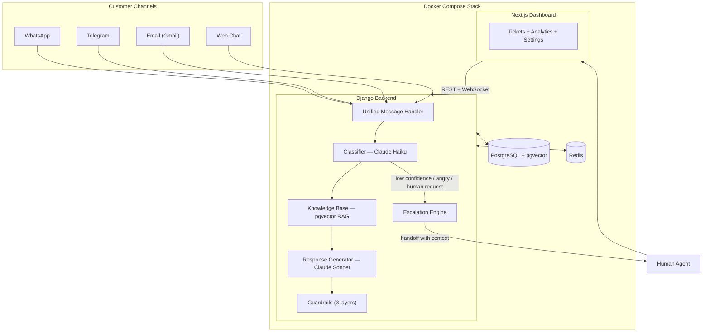

# AI Support Agent — Multi-Channel Customer Support System

> Replace a 3-person support team with AI. Handles WhatsApp, Telegram, Email, and Web Chat — costs **~$85/mo** instead of $1,500+ on Intercom or Zendesk.

Built with Django, Claude AI (Haiku + Sonnet), PostgreSQL + pgvector, and Next.js. Fully self-hosted via Docker Compose.

**Full tutorial on YouTube:** [CodeWithMuh](https://youtube.com/@codewithmuh)

   

---

## What It Does

- **Receives messages** from WhatsApp, Telegram, Email (Gmail), and Web Chat
- **AI classifies** each ticket (billing, technical, account, general) using Claude Haiku
- **Retrieves context** from your knowledge base via pgvector semantic search (RAG)
- **Generates responses** using Claude Sonnet — constrained to your KB only
- **Runs 3 guardrail checks** to prevent hallucinated policies, prices, or guarantees
- **Auto-escalates** to human agents when confidence is low, customer is angry, or requests a human
- **Dashboard** for agents to manage tickets, reply, and track analytics

### The 80/20 Approach

| | AI (80%) | Humans (20%) |
|---|---|---|
| **Handles** | Billing FAQs, shipping status, password resets, product questions | Complex disputes, angry customers, edge cases |
| **Speed** | < 2 seconds | Minutes to hours |
| **Context** | Full conversation + KB search | AI summary + suggested response + sentiment |

---

## Architecture



### Message Flow (8 Steps)

1. **Customer sends message** → WhatsApp, Telegram, Email, or Web Chat
2. **Normalize** → All channels feed into `UnifiedMessage` format
3. **Classify** → Claude Haiku determines category + confidence score
4. **Escalation check** → Confidence < 70%? Angry? Wants human? → Escalate
5. **Knowledge search** → pgvector finds relevant FAQ/doc chunks
6. **Generate response** → Claude Sonnet answers using KB context only
7. **Guardrail check** → Verify no fabricated policies/prices/guarantees
8. **Send response** → Reply via the original channel

---

## Tech Stack

| Component | Technology | Cost |
|-----------|-----------|------|
| Backend | Django + DRF + Django Channels | Free |
| AI Classification | Claude Haiku (fast, cheap) | ~$1/M tokens |
| AI Responses | Claude Sonnet (quality) | ~$3/M tokens |
| Embeddings | OpenAI text-embedding-3-small | ~$0.02/M tokens |
| Database | PostgreSQL + pgvector | Free (Docker) |
| WebSocket Layer | Redis + Django Channels | Free (Docker) |
| Dashboard | Next.js 15 + Tailwind CSS 4 | Free |
| Auth | JWT (djangorestframework-simplejwt) | Free |
| Infrastructure | Docker Compose | Free |
| WhatsApp | WhatsApp Cloud API (Meta) | Free (24h window) |
| Telegram | Telegram Bot API | Free |
| Email | Gmail API | Free |
| **Total** | | **~$85/mo** |

---

## Features

### Core AI
- **Multi-channel intake** — WhatsApp, Telegram, Email, Web Chat all normalized
- **Dual-model AI** — Haiku for fast classification, Sonnet for quality responses
- **RAG pipeline** — pgvector semantic search on your uploaded documents
- **3-layer guardrails** — System prompt + empty RAG fallback + response scan
- **Smart escalation** — 3 triggers: low confidence, negative sentiment, human request

### Dashboard
- **Ticket queue** — Filter by status (active/escalated/resolved), channel, search
- **Conversation view** — Chat-style thread with AI sidebar (classification, sentiment, suggestions)
- **Reply system** — Human/AI toggle, send reply or send & resolve, Ctrl+Enter shortcut
- **Analytics** — AI vs human resolution, channel breakdown, response times, circular gauges
- **Knowledge base manager** — Upload .txt/.md/.pdf, auto-chunk + embed
- **Canned responses** — Create reusable reply templates with shortcuts
- **Settings** — Configure WhatsApp, Telegram, Gmail credentials via UI (not just env vars)
- **Sandbox mode** — Toggle demo data on dashboard and analytics pages
- **Documentation** — Built-in docs page with setup guide and API reference

### Multi-Tenant
- **Team accounts** — Signup/login with JWT auth
- **Team isolation** — Each team gets their own data, channel configs, API keys
- **Role-based access** — Owner, admin, agent roles per team
- **API key auth** — Programmatic access via `X-API-Key` header

### UI/UX
- **Dark/light theme** — Toggle in sidebar and landing page, persists to localStorage
- **Landing page** — Hero with live chat demo, features, flow diagram, pricing comparison, tech stack
- **Responsive** — Works on desktop and mobile
- **Production build** — Next.js optimized build for fast page loads

---

## Quick Start

### Prerequisites

- [Docker & Docker Compose](https://docs.docker.com/get-docker/)
- [Anthropic API key](https://console.anthropic.com/)
- (Optional) [ngrok](https://ngrok.com/) for webhook testing

### 1. Clone & Configure

```bash
git clone https://github.com/codewithmuh/ai-support-agent.git
cd ai-support-agent
cp .env.example .env
```

Edit `.env` with your keys:

```env
# Required
ANTHROPIC_API_KEY=sk-ant-your-key-here
POSTGRES_PASSWORD=your-secure-password
SECRET_KEY=your-django-secret-key

# Optional — for real embeddings (falls back to pseudo-embeddings without this)
OPENAI_API_KEY=sk-your-openai-key

# Optional — for WhatsApp
WHATSAPP_ACCESS_TOKEN=EAA...
WHATSAPP_PHONE_NUMBER_ID=100956...
WHATSAPP_VERIFY_TOKEN=my-verify-token

# Optional — for Telegram
TELEGRAM_BOT_TOKEN=123456:ABC-DEF...

# Optional — for Gmail
GOOGLE_CREDENTIALS_PATH=/app/google-credentials.json
GMAIL_WATCH_ADDRESS=support@yourdomain.com
```

### 2. Start Everything

```bash
docker compose up -d --build
```

This starts 4 containers:
| Service | Port | Description |
|---------|------|-------------|
| **db** | 5432 | PostgreSQL + pgvector |
| **redis** | 6379 | Channel layer for WebSockets |
| **backend** | 8000 | Django API server |
| **frontend** | 3000 | Next.js dashboard |

### 3. Run Migrations

```bash
docker compose exec backend python manage.py migrate
```

### 4. Create Admin Account

```bash
docker compose exec backend python -c "
import os, django
os.environ['DJANGO_SETTINGS_MODULE'] = 'config.settings'
django.setup()
from django.contrib.auth.models import User
from teams.models import Team, TeamMembership
team = Team.objects.create(name='My Team', slug='my-team')
user = User.objects.create_user(username='admin@example.com', email='admin@example.com', password='admin123')
TeamMembership.objects.create(user=user, team=team, role='owner')
print('Done! Login: admin@example.com / admin123')
"
```

### 5. Open Dashboard

Go to [http://localhost:3000](http://localhost:3000)

- **Landing page** — see features, flow diagram, pricing
- **Login** — use the credentials from step 4
- **Sandbox mode** — enable on dashboard to see demo data
- **Docs** — built-in setup guide at `/docs`

---

## Connect Channels

### WhatsApp

1. Create a [Meta Developer](https://developers.facebook.com/) app → Add WhatsApp product
2. Get **Temporary Access Token** and **Phone Number ID** from API Setup
3. Start ngrok: `ngrok http 8000`
4. Set webhook URL in Meta dashboard: `https://{ngrok-url}/api/webhooks/whatsapp/`
5. Set verify token to match your `WHATSAPP_VERIFY_TOKEN` env var
6. Subscribe to **messages** webhook field
7. Add credentials to `.env` or via **Settings > WhatsApp** in dashboard

### Telegram

1. Message **@BotFather** on Telegram → `/newbot` → copy the bot token
2. Set webhook:
   ```bash
   curl "https://api.telegram.org/bot{TOKEN}/setWebhook?url={NGROK_URL}/api/webhooks/telegram/"
   ```
3. Add token to `.env` or via **Settings > Telegram** in dashboard
4. Send a message to your bot — AI responds automatically

### Gmail

1. Enable Gmail API in [Google Cloud Console](https://console.cloud.google.com/)
2. Create OAuth2 credentials → download JSON → place at `google-credentials.json`
3. Set `GOOGLE_CREDENTIALS_PATH` and `GMAIL_WATCH_ADDRESS` in `.env`
4. Poll for emails: `curl -X POST http://localhost:8000/api/email/poll/`

### Web Chat

Already built in — uses WebSocket at `ws://localhost:8000/ws/chat/`

---

## Upload Knowledge Base

The AI only answers from your knowledge base. Without KB data, it will escalate everything.

### Via Dashboard
1. Go to **Knowledge Base** in sidebar
2. Click **Upload Document**
3. Select `.txt`, `.md`, or `.pdf` file
4. Choose category → auto-chunked and embedded

### Via API
```bash
curl -X POST http://localhost:8000/api/knowledge-base/upload/ \
  -F "file=@faq.txt" \
  -F "category=general"
```

### Via Script
```bash
docker compose exec backend python scripts/seed_knowledge_base.py
```

---

## API Reference

### Core

| Method | Endpoint | Description |
|--------|----------|-------------|
| POST | `/api/process/` | Process a message through the AI pipeline |
| GET | `/api/conversations/` | List all conversations |
| GET | `/api/conversations/<id>/` | Get conversation with messages |
| POST | `/api/conversations/<id>/reply/` | Send manual agent reply |
| GET/POST | `/api/knowledge/` | List or add KB entries |
| POST | `/api/knowledge-base/upload/` | Upload a document to KB |

### Webhooks (no auth)

| Method | Endpoint | Description |
|--------|----------|-------------|
| GET/POST | `/api/webhooks/whatsapp/` | WhatsApp Cloud API |
| POST | `/api/webhooks/telegram/` | Telegram Bot API |
| POST | `/api/webhooks/email/` | Gmail push notification |
| POST | `/api/email/poll/` | Manual Gmail poll |
| WS | `ws://localhost:8000/ws/chat/` | Web Chat WebSocket |

### Escalation

| Method | Endpoint | Description |
|--------|----------|-------------|
| GET | `/api/escalations/` | List escalations |
| POST | `/api/escalations/<id>/resolve/` | Resolve with response (sends to customer) |
| GET | `/api/escalations/dashboard/stats/` | Dashboard analytics |

### Auth & Teams

| Method | Endpoint | Description |
|--------|----------|-------------|
| POST | `/api/auth/signup/` | Create team + user |
| POST | `/api/auth/login/` | Login → JWT tokens |
| POST | `/api/auth/refresh/` | Refresh JWT |
| GET | `/api/auth/me/` | Current user + team |
| GET/PUT | `/api/team/` | Team details |
| GET/POST/PUT | `/api/team/whatsapp/` | WhatsApp config |
| GET/POST/PUT | `/api/team/telegram/` | Telegram config |
| GET/POST/PUT | `/api/team/gmail/` | Gmail config |

### Scale Features

| Method | Endpoint | Description |
|--------|----------|-------------|
| GET/POST | `/api/tags/` | Manage tags |
| POST | `/api/conversations/<id>/notes/` | Add internal note |
| GET/POST | `/api/canned-responses/` | Reply templates |
| GET | `/api/search/?q=term` | Full-text search |
| POST | `/api/bulk-actions/` | Bulk resolve/tag |

---

## Testing

```bash
# Normal question (AI handles it)
curl -X POST http://localhost:8000/api/process/ \
  -H "Content-Type: application/json" \
  -d '{
    "message": "What are your pricing plans?",
    "sender_id": "test_user_1",
    "sender_name": "John",
    "channel": "webchat"
  }'

# Escalation trigger (human handoff)
curl -X POST http://localhost:8000/api/process/ \
  -H "Content-Type: application/json" \
  -d '{
    "message": "This is ridiculous! I want to speak to a real person NOW",
    "sender_id": "test_user_2",
    "sender_name": "Jane",
    "channel": "webchat"
  }'
```

---

## Escalation Triggers

| Trigger | Condition | Example |
|---------|-----------|---------|
| Low confidence | Haiku confidence < 0.7 | Ambiguous or unusual request |
| Negative sentiment | Anger/frustration detected | "This is ridiculous", "I'm furious" |
| Human request | Explicit phrase match | "Talk to a human", "speak to a manager" |

When escalated, the human agent gets:
- Full conversation history
- AI-generated summary (Haiku)
- Suggested response (Sonnet)
- Sentiment analysis
- One-click "Send & Resolve" button

---

## Anti-Hallucination Guardrails

| Layer | How It Works |
|-------|-------------|
| **System prompt** | "Only answer based on provided knowledge base context" |
| **Empty RAG check** | No relevant chunks → decline to answer, offer human |
| **Response scan** | Flags mentions of policies/prices/guarantees not in KB |

---

## Cost Breakdown

| Service | Monthly Cost |
|---------|-------------|
| Claude API (est. 5k tickets/mo) | ~$50-60 |
| OpenAI Embeddings | ~$5 |
| VPS (2GB, DigitalOcean/Hetzner) | ~$12-20 |
| Domain + SSL | ~$1-5 |
| WhatsApp Business API | Free |
| Telegram Bot API | Free |
| Gmail API | Free |
| **Total** | **~$70-90/mo** |

vs. Intercom ($79/seat + $0.99/resolution), Zendesk ($55-115/agent), Freshdesk ($49-79/agent)

---

## Project Structure

```
ai-support-agent/
├── config/                 # Django settings, ASGI, URLs
├── core/                   # AI brain (classifier, responder, RAG, guardrails, embeddings)
├── channels_app/           # WhatsApp, Telegram, Email, WebSocket integrations
├── escalation/             # Human handoff, sentiment analysis, dashboard stats
├── teams/                  # Multi-tenant: auth, team models, channel configs
├── dashboard/              # Next.js dashboard + landing page
│   ├── src/app/            # Pages (tickets, analytics, settings, docs, login, etc.)
│   ├── src/components/     # Reusable components (TicketQueue, ConversationThread, etc.)
│   └── src/lib/            # Auth context, theme, API config
├── templates/              # Django templates (privacy, terms for Meta verification)
├── docker-compose.yml      # Full stack: Postgres, Redis, Django, Next.js
├── Dockerfile              # Django backend
└── dashboard/Dockerfile    # Next.js frontend (production build)
```

---

## Environment Variables

| Variable | Required | Description |
|----------|----------|-------------|
| `SECRET_KEY` | Yes | Django secret key |
| `ANTHROPIC_API_KEY` | Yes | Claude API key |
| `POSTGRES_PASSWORD` | Yes | Database password |
| `DATABASE_URL` | Yes | PostgreSQL connection string |
| `OPENAI_API_KEY` | No | For real embeddings (falls back to pseudo) |
| `WHATSAPP_ACCESS_TOKEN` | No | Meta WhatsApp API token |
| `WHATSAPP_PHONE_NUMBER_ID` | No | WhatsApp phone number ID |
| `WHATSAPP_VERIFY_TOKEN` | No | Webhook verify token (you make this up) |
| `TELEGRAM_BOT_TOKEN` | No | From @BotFather |
| `GOOGLE_CREDENTIALS_PATH` | No | Path to Gmail OAuth JSON |
| `GMAIL_WATCH_ADDRESS` | No | Gmail address to monitor |
| `REDIS_URL` | No | Default: redis://redis:6379/0 |

---

## Contributing

1. Fork the repo
2. Create a feature branch: `git checkout -b feature/my-feature`
3. Commit your changes: `git commit -m 'Add my feature'`
4. Push: `git push origin feature/my-feature`
5. Open a Pull Request

---

## License

MIT — use it, modify it, sell it as a service, build on top of it.

---

## Star History

If this helped you, give it a star on GitHub!

---

**Built live on [CodeWithMuh](https://youtube.com/@codewithmuh) using [Claude Code](https://claude.ai/claude-code).**
