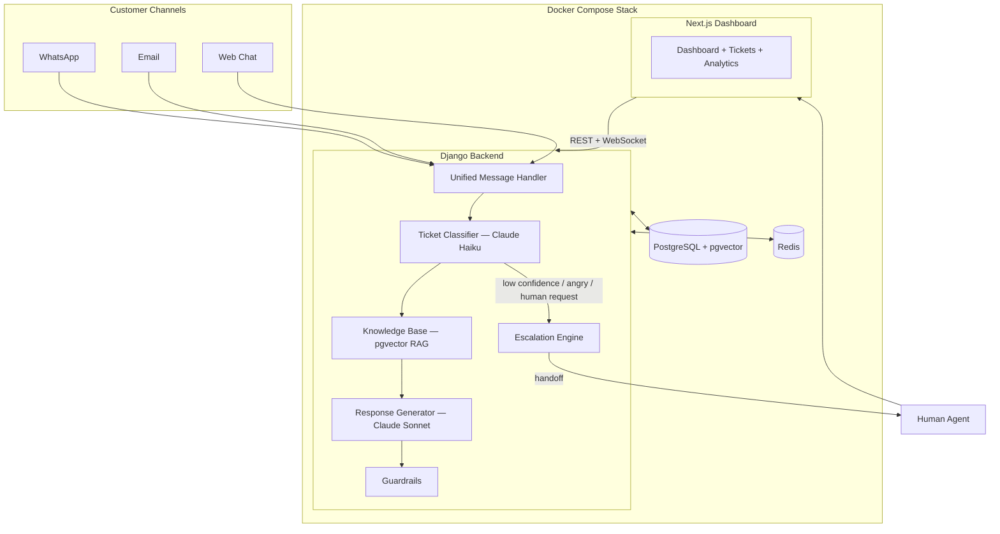

# AI Support Agent — Multi-Channel Customer Support System

> This AI agent replaced a 3-person support team. Handles WhatsApp, Email, and Web Chat — costs $85/mo instead of $990+ on Intercom or Zendesk.

Built with Django, Claude AI, PostgreSQL + pgvector, and Next.js. Fully self-hosted via Docker Compose.

**Full tutorial on YouTube:** [CodeWithMuh](https://youtube.com/@codewithmuh)

---

## Architecture



### How It Works

1. **Message comes in** (WhatsApp, Email, or Web Chat) → normalized into a unified format
2. **Claude Haiku classifies** the ticket (billing, technical, account, complaint) with a confidence score
3. **Escalation check** — if confidence < 0.7, negative sentiment detected, or customer asks for a human → instant handoff
4. **pgvector RAG** pulls relevant knowledge base chunks based on the classification
5. **Claude Sonnet generates** a response constrained to the knowledge base context only
6. **Guardrails check** the response for hallucinated policies, prices, or guarantees
7. **Response sent** back through the original channel
8. **Everything stored** in PostgreSQL for conversation history and analytics

---

## Tech Stack

| Component | Technology | Cost |
|-----------|-----------|------|
| Backend | Django + DRF + Django Channels | — |
| AI Classification | Claude Haiku | ~$1/M tokens |
| AI Responses | Claude Sonnet | ~$3/M tokens |
| Database | PostgreSQL + pgvector | — |
| WebSocket Layer | Redis + Django Channels | — |
| Dashboard | Next.js + Tailwind CSS | — |
| Infrastructure | Docker Compose | — |
| WhatsApp | WhatsApp Cloud API | Free (24h window) |
| Email | Gmail API | Free |
| **Total** | | **~$85/mo** |

---

## Quick Start

### Prerequisites

- Docker & Docker Compose
- Anthropic API key ([get one here](https://console.anthropic.com/))
- (Optional) WhatsApp Business API credentials
- (Optional) Gmail API credentials

### 1. Clone & Configure

```bash
git clone https://github.com/codewithmuh/ai-support-agent.git
cd ai-support-agent
cp .env.example .env
```

Edit `.env` and add your API keys:

```env
ANTHROPIC_API_KEY=sk-ant-your-key-here
POSTGRES_PASSWORD=your-secure-password
SECRET_KEY=your-django-secret-key
```

### 2. Start Everything

```bash
docker compose up
```

This starts:
- **PostgreSQL** (pgvector) on port 5432
- **Redis** on port 6379
- **Django backend** on port 8000
- **Next.js dashboard** on port 3000

### 3. Seed the Knowledge Base

```bash
docker compose exec backend python scripts/seed_knowledge_base.py
```

### 4. Open the Dashboard

Go to [http://localhost:3000](http://localhost:3000)

---

## API Endpoints

### Core

| Method | Endpoint | Description |
|--------|----------|-------------|
| POST | `/api/process/` | Process a message through the AI pipeline |
| GET | `/api/conversations/` | List all conversations |
| GET | `/api/conversations/<id>/` | Get conversation with messages |
| GET/POST | `/api/knowledge/` | List or add knowledge base entries |

### Channels

| Method | Endpoint | Description |
|--------|----------|-------------|
| GET/POST | `/api/webhooks/whatsapp/` | WhatsApp webhook (verify + receive) |
| POST | `/api/webhooks/email/` | Gmail push notification webhook |
| POST | `/api/email/poll/` | Manually poll Gmail for new emails |
| WS | `ws://localhost:8000/ws/chat/` | Web chat WebSocket |

### Escalation & Dashboard

| Method | Endpoint | Description |
|--------|----------|-------------|
| GET | `/api/escalations/` | List escalations (`?resolved=true/false`) |
| GET/PUT | `/api/escalations/<id>/` | Get or update escalation |
| POST | `/api/escalations/<id>/resolve/` | Resolve an escalation |
| GET | `/api/dashboard/stats/` | Dashboard analytics |

---

## Testing the AI Brain

Send a test message via the API:

```bash
# Normal question (AI handles it)
curl -X POST http://localhost:8000/api/process/ \
  -H "Content-Type: application/json" \
  -d '{
    "message": "What are your pricing plans?",
    "sender_id": "test_user_1",
    "sender_name": "John",
    "channel": "webchat"
  }'

# Escalation trigger (human handoff)
curl -X POST http://localhost:8000/api/process/ \
  -H "Content-Type: application/json" \
  -d '{
    "message": "This is ridiculous! I want to speak to a real person NOW",
    "sender_id": "test_user_2",
    "sender_name": "Jane",
    "channel": "webchat"
  }'
```

---

## Escalation Triggers

The AI escalates to a human agent when any of these conditions are met:

| Trigger | Threshold | Example |
|---------|-----------|---------|
| Low confidence | Haiku confidence < 0.7 | Ambiguous or unusual request |
| Negative sentiment | Keywords detected | "This is ridiculous", "I'm furious" |
| Human request | Phrase match | "Talk to a human", "speak to a manager" |

When escalated:
- Customer gets: *"I understand your concern. Let me connect you with a team member right away."*
- Human agent gets: full conversation history + AI summary + suggested response

---

## Anti-Hallucination Guardrails

Three layers prevent the AI from making things up:

1. **System prompt** — "Only answer based on the provided knowledge base context"
2. **Empty RAG check** — No relevant chunks found → decline to answer, offer human
3. **Response scan** — Flags mentions of policies, prices, or guarantees not present in the knowledge base

---

## WhatsApp Setup

1. Create a [Meta Developer](https://developers.facebook.com/) app
2. Add WhatsApp product, get your access token and phone number ID
3. Set webhook URL to `https://your-domain/api/webhooks/whatsapp/`
4. Use ngrok for local development: `ngrok http 8000`
5. Add credentials to `.env`

> WhatsApp Business API messages are **free** within the 24-hour customer-initiated window.

---

## Gmail Setup

1. Enable Gmail API in [Google Cloud Console](https://console.cloud.google.com/)
2. Create OAuth2 credentials (or service account)
3. Download credentials JSON
4. Add path to `.env` as `GOOGLE_CREDENTIALS_PATH`
5. For push notifications, set up a Pub/Sub topic pointing to `/api/webhooks/email/`
6. Or use the poll endpoint: `POST /api/email/poll/`

---

## Project Structure

```
ai-support-agent/
├── config/                 # Django settings, ASGI, URLs
├── core/                   # AI brain (classifier, responder, RAG, guardrails)
├── channels_app/           # WhatsApp, Email, WebSocket integrations
├── escalation/             # Human handoff, sentiment analysis, dashboard stats
├── dashboard/              # Next.js admin dashboard
├── scripts/                # Knowledge base seeder
├── docker-compose.yml      # Full stack: Postgres, Redis, Django, Next.js
├── Dockerfile              # Django backend
└── dashboard/Dockerfile    # Next.js frontend
```

---

## Cost Breakdown

| Service | Monthly Cost |
|---------|-------------|
| Claude API (est. 5k tickets/mo) | ~$50 |
| VPS (2GB, DigitalOcean/Hetzner) | ~$12 |
| Domain + SSL | ~$1 |
| WhatsApp Business API | Free |
| Gmail API | Free |
| **Total** | **~$63-85** |

vs. Intercom AI ($990/mo) or Zendesk AI ($1,500/mo)

---

## License

MIT — use it, modify it, sell it as a service.

---

## Built With

Built live on [CodeWithMuh](https://youtube.com/@codewithmuh) using [Claude Code](https://claude.ai/claude-code).
